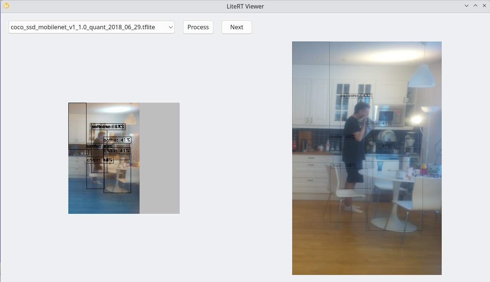

The project as a whole is distributed under the GNU General Public License (GPL),
due to its dependency on Qt.

However, files from the **core** can be reused under BSD License.

https://ai.google.dev/edge/api/litert/c/classlitert/1-1-tensor-buffer