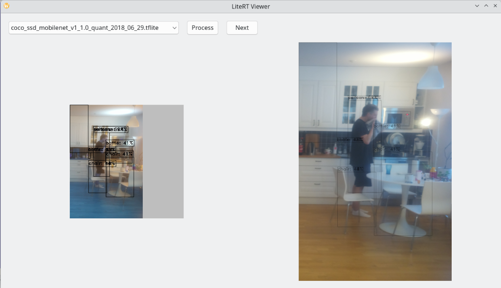

*******
License
*******

The project as a whole is distributed under the GNU General Public License (GPL) v. 3,
due to its dependency on Qt.

However, files from the **./core** directory can be reused under BSD License.

************
Introduction
************

This a C++ application that demonstate how to run TFLite models using
LiteRT *CompiledModel* API.

********
Building
********

Obtaining sources
=================

| git clone https://github.com/konstaty/litert-examples.git
| cd litert-examples
| git submodule update --init --checkout

Installing dependencies
=======================

Qt
--
| apt install qt6-base-dev qt6-declarative-dev qt6-wayland

OpenCV
------
| apt install libopencv-core-dev

Clang
-----
| apt install clang-tools-18 clang-tidy-18 clang-18

Configuring & Making
======================

Before running cmake, make sure it will choose Clang compiler. For example, you can set these two
environment variables (if you use Clang 18)::

 export CXX=/usr/bin/clang++-18
 export CC=/usr/bin/clang-18

| mkdir build
| cmake -B build .
| cmake --build build --parallel 4

Usage
=====

Place images into **./images** directory.

Place TFLite models into **./models** directory.

Start apllication: ``./build/lrex``

Use the **Process** and **Next** buttons to run inference on the current image and the next image, respectivelly.

LiteRT API Reference: https://ai.google.dev/edge/api